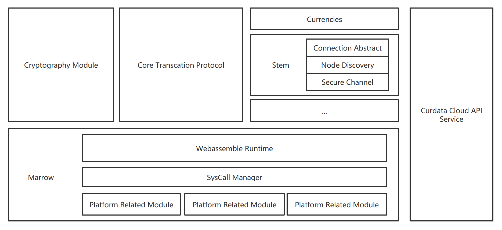

# EWF: Extendable Wallet Framework

*read in other language: [English](README.en.md)*

## Table of Contents

- [Overview](#Overview)
- [Design](#Design)
  - [Documents](#Documents)
  - [RFC](#RFC)
  - [Related Project](#Related-project)
- [State of project](#state-of-project)
- [License](#License)

## Overview

EWF是一个为DCEP设计的多功能，多场景，可扩展的钱包框架。EWF的设计考虑到多平台，多场景，多功能的需求，采用基于Actor模型的模块化设计，使用Rust实现，保证框架运行的稳定性与内存安全性。同时EWF会提供可运行在 `Webassemble` 安全沙箱环境内的框架主体，进一步提升EWF的安全性，稳定性与多环境适配性。

EWF的技术架构图如下：

## Design

### Documents

- [Documents](#Whitepaper): 描述了`EWF` 使用相关的文档。
- [RFCs](https://github.com/Curdata-project/Curdata/tree/master/rfcs): 描述了`EWF` 及其相关系统的设计。

### Related-project

- [Stem](https://github.com/Yinet-project/Stem): 基于P2P协议的分布式网络基础设施。
- [Marrow](https://github.com/Yinet-project/marrow): 构建于 `Webassemle` 上的安全运行环境。

## State of project

***EWF process!***

We present project's roadmap here.

### Contribute

There are many way to contribute us. We welcome all type of contributions.

#### Help with the design

Please create issue for related project to discuss. Then you can propose a RFC
to make these discuss to be a standard.

#### Help with the implementations

You can make issue and pull request for related implementation project.

## License

Apache-2.0